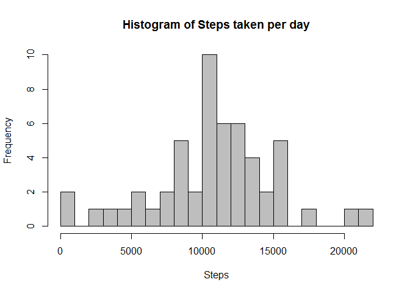
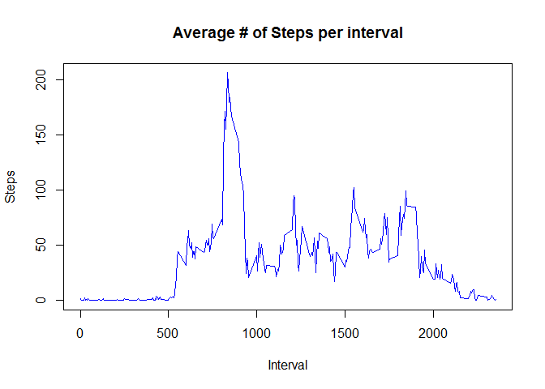
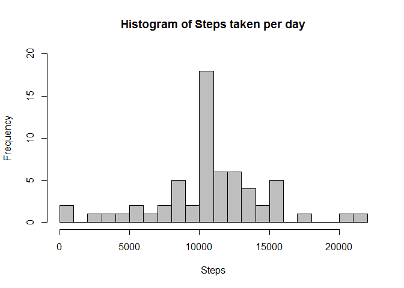

# Reproducible Research: Peer Assessment 1
---
  
  
## Loading and preprocessing the data

```r
data <- read.table(unz("activity.zip", "activity.csv"), sep = ",", header = TRUE)
data$IsWeekend <- weekdays(as.Date(data$date)) %in% c("Saturday", "Sunday")
data$IsWeekend <- factor(data$IsWeekend, labels = c("Weekday", "Weekend"))
```

## What is mean total number of steps taken per day?

```r
totalStepsPerDay <- aggregate(data$steps, by = list(data$date), FUN = sum)
names(totalStepsPerDay) <- c("date", "steps")
```

```r
hist(totalStepsPerDay$steps, breaks = 20, ylim = range(0, 10),
     col = "gray", main = "Histogram of Steps taken per day", xlab = "Steps")
```

 

* The mean total number of steps taken per day is 10,766.19.  
* The median total number of steps taken per day is 10,765.  

## What is the average daily activity pattern?

```r
cleanData <- data[!is.na(data$steps), ]
stepsPer5MinInterval <- aggregate(cleanData$steps, by = list(cleanData$interval), FUN = mean)
names(stepsPer5MinInterval) <- c("interval", "steps")
```

```r
with(stepsPer5MinInterval, plot(interval, steps, type = "l", main = "Average # of Steps per interval",
                                xlab = "Interval", ylab = "Steps", col = "blue"))
```

 

The 5-minute interval 835, on average across all the days in the dataset, contains the maximum number of steps, 206 steps.  

## Imputing missing values

There are 2,304 missing values. That is 13.11% of the dataset.  
For each missing value, either the mean value for that 5-minute interval (computed from other dates) is used if available, else the mean value for that date is used to fill.

```r
newData <- data
naRows <- is.na(newData$steps)
for (i in 1:nrow(newData[naRows, ])) {
    interval <- newData[naRows, ][i, "interval"]
    date <- newData[naRows, ][i, "date"]
    steps <- stepsPer5MinInterval[stepsPer5MinInterval$interval == interval, "steps"]
    if (length(steps) != 0){
        newData[naRows, ][i, "steps"] <-
            stepsPer5MinInterval[stepsPer5MinInterval$interval == interval, "steps"]
    } else {
        newData[naRows, ][i, "steps"] <- mean(cleanData[cleanData$date == date, ]$steps)
    }
}
```

```r
newTotalStepsPerDay <- aggregate(newData$steps, by = list(newData$date), FUN = sum)
names(newTotalStepsPerDay) <- c("date", "steps")
```

```r
hist(newTotalStepsPerDay$steps, breaks = 20, ylim = range(0, 20),
     col = "gray", main = "Histogram of Steps taken per day", xlab = "Steps")
```

 

From the imputed dataset:  
* The mean total number of steps taken per day is 10,766.19.  
* The median total number of steps taken per day is 10,766.19.  

It appears that the mean and median values of the imputed dataset do not differ from those of the original dataset.  

## Are there differences in activity patterns between weekdays and weekends?

```r
newStepsPer5MinInterval <- aggregate(newData$steps, by = list(newData$interval, newData$IsWeekend), FUN = mean)
names(newStepsPer5MinInterval) <- c("interval", "IsWeekend", "steps")
library(lattice)
xyplot(steps ~ interval | IsWeekend, data = newStepsPer5MinInterval, type = "l",
       xlab = "Interval", ylab = "Number of Steps", layout = c(1, 2))
```

 
